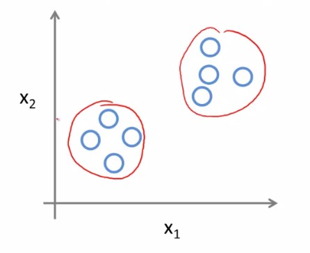

 

  

  <h1 align ="center">Machine Learning</h1>

  

    Notes taken, while going through the following course on Coursera:
    
    
	   <a href="https://www.coursera.org/learn/machine-learning">
            <strong>Explore the course »</strong>
       </a>
    
    
 

 

# Introduction

 

## Applications

- Data mining
    -  Large datasets from growth of automation/web. 
         
        For example, web click data, medical records, computational biology, engineering etc.

- Applications that we can't program by hand.
    - Autonomous helicopter, handwriting recognition, most of NLP, computer vision etc.

- Self-customizing programs
    - Amazon, Netflix product recommendations etc.

- Understanding human learning (brain, real AI)

 

## What is Machine Learning?

- Field of study that gives computers the ability to learn without being explicitly programmed. (Arther Samuel, 1959)

- Well-posed Learning Problem:  
  A computer program is said to learn from **experience E** with respect to some **task T** and some **performance measure P**, if its performance on **T**, as measure by **P**, improves with experience **E**.  
  > "Experience Makes A Program Wiser"

 

## Types of Algorithms

- Supervised Learning

- Unsupervised Learning

> **Others:** Reinforcement learning, recommender systems etc.

 

## Supervised Learning

- **Labeled Dataset**, some correct answers are given on the dataset.

- Housing Price Prediction

  (Regression Algorithm - predicting continuous valued output)

  

  We can draw a straight line through the cross points (Or known data) and predict our price for a 750 feet2 house from that straight line.
  
  However, we will get more accurate result if we draw a quadric function through the known dataset instead of just drawing a straight line. 

  >Picking, which function define the dataset more accurately, is our choice.

- Breast Cancer Classification (Malignant, Benign)

  (Classification Algorithm - predicting discrete valued output)

  

  Trying to predict if a tumor is malignant/benign from its size, when the dataset contains the correct answers for some of the tumor sizes. (Based on 1 feature only)

  

  Trying to predict if a certain aged patient has a malignant/benign tumor, when the dataset contains the correct answers for some (patient age, tumor size) pairs. (Based on 2 features)

  >Interestingly, we have some algorithms, which can learn from infinite number of features. 

  >But how do we even store an infinite number of things in the computer when its memory capacity is limited. It turns out that when we talk about an algorithm called the Support Vector Machine, it has a neat mathematical trick that allows a computer to deal with an infinite number of features.

 

## Unsupervised Learning

- **Non-labeled Dataset**, no label (correct/wrong) is given on the dataset. We will have to find some structure on the given data. 

> The algorithm will not try to provide any labeled output here. It will just try to find the similarity among some of the data via finding some structure on the dataset.

> For example, market segmentation, social network analysis, astronomical data analysis etc.

- Clustering Algorithm

  

  >One application of this, is on Google News. 
  
  >Every day hundreds of thousands news stories are published, and google news groups them into cohesive news stories.

- Cocktail Party Algorithm

  Suppose, we are in a cocktail party, where two of our friends, Mamun & Shuvo are giving speech at the same time yet in two different corners of the room. And we have two microphones on the room, at different relative (random) distances from Alice & Bob.

  So, naturally, each microphone will record a different combination of their voices. Maybe Mamun's voice will seem louder on microphone1 and maybe Shuvo's voice will seem louder on microphone2. But each microphone would cause an overlapping combination of both of their voices.

  What we can do is, give these two recordings as input to the cocktail party algorithm. 

  The algorithm will then try to find a similar structure on the dataset, which is trying to distinguish the similar voice in this case and separate the two recordings. 

 
 

# Linear Regression With One Variable

 

# Linear Algebra Review

# Linear Regression With Multiple Variables

# Octave/Matlab Tutorial

# Logistic Regression

# Regularization

# Neural Networks: Representation

# Neural Networks: Learning

